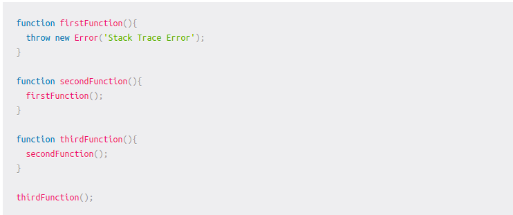

# The JavaScript Call Stack - What It Is and Why It's Necessary

### The JavaScript engine (which is found in a hosting environment like the browser), is a single-threaded interpreter comprising of a heap and a single call stack. The browser provides web APIs like the DOM, AJAX, and Timers.

### This article is aimed at explaining what the call stack is and why it is needed. An understanding of the call stack will give clarity to how “function hierarchy and execution order” works in the JavaScript engine.

### The call stack is primarily used for function invocation (call). Since the call stack is single, function(s) execution, is done, one at a time, from top to bottom. It means the call stack is synchronous.

### The understanding of the call stack is vital to Asynchronous programming (which we will look at in a later article).

### In Asynchronous JavaScript, we have a callback function, an event loop, and a task queue. The callback function is acted upon by the call stack during execution after the call back function has been pushed to the stack by the event loop.

### But before we jump the gun, let us first attempt to answer the question - What is the call stack?

### At the most basic level, a call stack is a data structure that uses the Last In, First Out (LIFO) principle to temporarily store and manage function invocation (call).

## Let’s break down our definition:

### LIFO: When we say that the call stack, operates by the data structure principle of Last In, First Out, it means that the last function that gets pushed into the stack is the first to be pop out, when the function returns.

### Let us take a look at a code sample to demonstrate LIFO by printing a stack trace error to the console.

