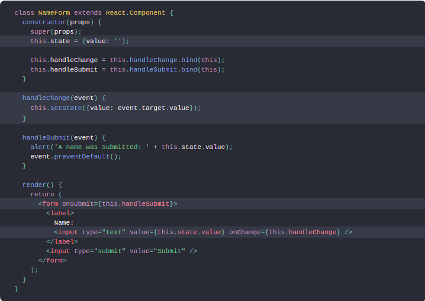

# Controlled Components

### In HTML, form elements such as <input>, <textarea>, and <select> typically maintain their own state and update it based on user input. In React, mutable state is typically kept in the state property of components, and only updated with setState().

### We can combine the two by making the React state be the “single source of truth”. Then the React component that renders a form also controls what happens in that form on subsequent user input. An input form element whose value is controlled by React in this way is called a “controlled component”.

### For example, if we want to make the previous example log the name when it is submitted, we can write the form as a controlled component:

### Since the value attribute is set on our form element, the displayed value will always be this.state.value, making the React state the source of truth. Since handleChange runs on every keystroke to update the React state, the displayed value will update as the user types.

### With a controlled component, the input’s value is always driven by the React state. While this means you have to type a bit more code, you can now pass the value to other UI elements too, or reset it from other event handlers.

# The Conditional (Ternary) Operator

## First, we’ll take a look at the syntax of a typical if statement:

### if ( condition ) {
###  value if true;
### } else {
###  value if false;
### }

## Now, the ternary operator:

### condition ? value if true : value if false