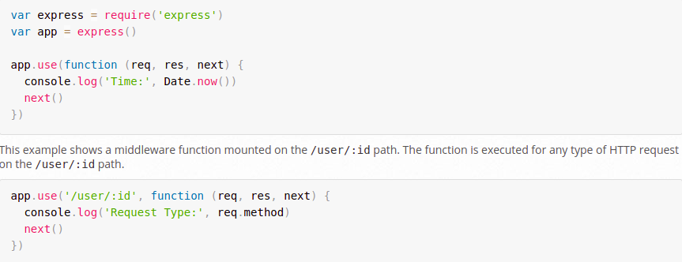

### Name 3 real world use cases where you’d want to change the request with custom middleware

#### 1) Translator

##### We can create a middleware that makes use of a data conversion library and translates the requests to a format that the receiving service can understand.

#### 2) Accumulating-Duplicating Data

#### 3) API Security

### True or false: The route handler is middleware?

#### They are not middleware functions by definition. If such function is used on routing methods then they are only handler functions. We use such a handler function which is not a middleware when it is the only one callback function.

### In what ways can a middleware function end the process and send data to the browser?

#### wh can use the Next()

### At what point in the request lifecycle can you “inject” middleware?

#### between the raout and the callback function in the Endpoint

### What can cause express to error with “Request headers sent twice, cannot start a second response”

## Middleware

#### Middleware functions are functions that have access to the request object (req), the response object (res), and the next function in the application’s request-response cycle. The next function is a function in the Express router which, when invoked, executes the middleware succeeding the current middleware.

#### Middleware functions can perform the following tasks:

#### 1-Make changes to the request and the response objects.

#### 3-End the request-response cycle.

#### 4-Call the next middleware in the stack.

#### 5-If the current middleware function does not end the request-response cycle, it must call next() to pass control to the next middleware function. Otherwise, the request will be left hanging.

## what is The req object

## The req object represents the HTTP request and has properties for the request query string, parameters, body, HTTP headers, and so on.

## what is The res object?

#### he res object represents the HTTP response that an Express app sends when it gets an HTTP request.

#### In this documentation and by convention, the object is always referred to as res (and the HTTP request is req) but its actual name is determined by the parameters to the callback function in which you’re working.

## Application-level middleware

### Bind application-level middleware to an instance of the app object by using the app.use() and app.METHOD() functions, where METHOD is the HTTP method of the request that the middleware function handles (such as GET, PUT, or POST) in lowercase.

### This example shows a middleware function with no mount path. The function is executed every time the app receives a request.

